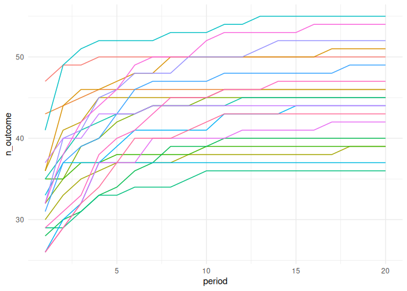
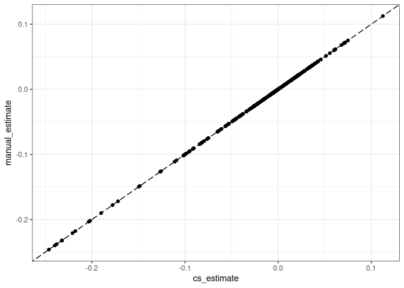

<!-- README.md is generated from README.Rmd. Please edit that file -->

# fabdid

[](https://github.com/EdJeeOnGitHub/fabdid/actions/workflows/R-CMD-check.yaml)

fab(_ulous_)did - `fabdid` performs Fast Absorbing Binary Difference-in-Differences
estimation. When outcome data is binary and *absorbing*, i.e. if
$Y_{it} = 1 \implies Y_{it'} = 1, \forall t' > t$, `fabdid` estimates
Callaway and Sant’Anna (2021) style $ATT(g,t)$s quickly.

**Currently `fabdid` is hardcoded to very specific usecases.**

## Installation

You can install the development version of fabdid like so:

``` r
remotes::install_github("EdJeeOnGitHub/fabdid")
```

## Binary Absorbing Outcome Example

``` r
library(fabdid)
## basic example code
library(ggplot2)
library(dplyr)
#> 
#> Attaching package: 'dplyr'
#> The following objects are masked from 'package:stats':
#> 
#>     filter, lag
#> The following objects are masked from 'package:base':
#> 
#>     intersect, setdiff, setequal, union
library(data.table)
#> 
#> Attaching package: 'data.table'
#> The following objects are masked from 'package:dplyr':
#> 
#>     between, first, last
library(purrr)
#> 
#> Attaching package: 'purrr'
#> The following object is masked from 'package:data.table':
#> 
#>     transpose
ncl <- 1
time.periods <- 4
biters <- 200
```

``` r
# Creates simulation params
sim_params = did::reset.sim(time.periods = 20, n = 1000)
sim_df = did::build_sim_dataset(sp_list = sim_params, panel = TRUE) %>%
    as_tibble()
binary_sim_df = sim_df %>%
    group_by(G) %>%
    mutate(Y_above = Y > quantile(Y, 0.15)) %>%
    ungroup() %>%
    group_by(id) %>%
    mutate(
        first_Y =  min(period[Y_above == TRUE])
    ) %>%
    mutate(Y_binary = period >= first_Y)
#> Warning: There were 56 warnings in `mutate()`.
#> The first warning was:
#> ℹ In argument: `first_Y = min(period[Y_above == TRUE])`.
#> ℹ In group 6: `id = 7`.
#> Caused by warning in `min()`:
#> ! no non-missing arguments to min; returning Inf
#> ℹ Run `dplyr::last_dplyr_warnings()` to see the 55 remaining warnings.

binary_sim_df %>%
    group_by(period, G) %>%
    summarise(n_outcome = sum(Y_binary)) %>%
    ggplot(aes(
        x = period, 
        y = n_outcome, 
        colour = factor(G)
    )) +
    geom_line() +
    theme_minimal() +
    guides(colour = "none")
#> `summarise()` has grouped output by 'period'. You can override using the
#> `.groups` argument.
```



Using Callaway and Sant’Anna’s `did` package:

``` r
tictoc::tic()
cs_fit = did::att_gt(
    data = binary_sim_df,
    yname = "Y_binary",
    tname = "period",
    gname = "G",
    est_method = "ipw",
    idname = "id",
    print_details = FALSE,
    bstrap = TRUE,
    biter = 1000,
    control_group = "notyettreated" )
#> Warning in did::att_gt(data = binary_sim_df, yname = "Y_binary", tname =
#> "period", : Not returning pre-test Wald statistic due to singular covariance
#> matrix
tictoc::toc()
#> 8.087 sec elapsed

tidy_cs_fit = broom::tidy(cs_fit) %>% as_tibble()
```

Using `fabdid`:

``` r
df = as.data.table(binary_sim_df)
tictoc::tic()
manual_did = estimate_did(
    df,
    y_var = "first_Y",
    group_var = "G",
    t_var = "period",
    id_var = "id"
)$att_df
#>  ■■■■■■■■■■■■■■■■■■■■              65% |  ETA:  1s
tictoc::toc()
#> 5.135 sec elapsed
```

Comparing the two:

``` r
comp_df = inner_join(
    manual_did %>% rename(manual_estimate = att_g_t),
    tidy_cs_fit %>%
        select(group, time, cs_estimate = estimate), 
    by = c("group","time")
)


comp_df %>%
    ggplot(aes(
        x = cs_estimate,
        y = manual_estimate
    )) +
    geom_point() +
    geom_abline(linetype = "longdash") +
    theme_bw()
```


